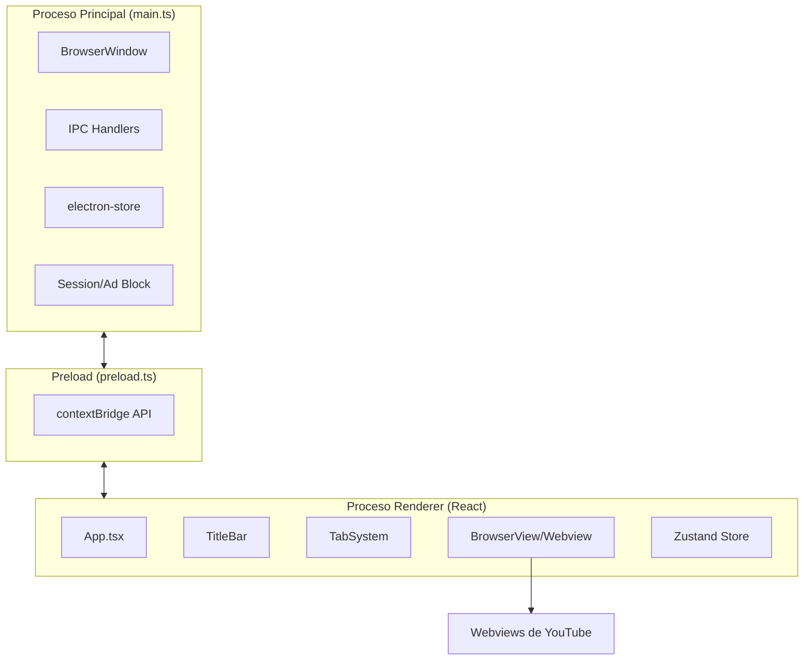
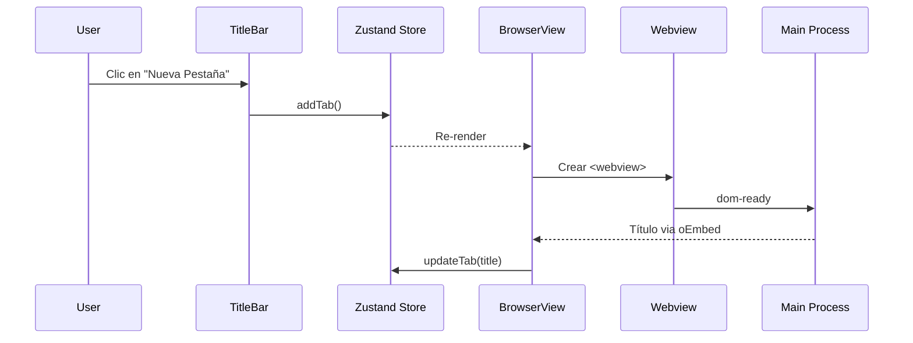

# Arquitectura Técnica - YouTube Desktop

## 🏗️ Visión General

YouTube Desktop es una aplicación de escritorio construida con Electron que utiliza una arquitectura de tres procesos:



---

## 📂 Estructura de Procesos

### 1. Proceso Principal (`src/main/main.ts`)

**Responsabilidades:**
- Crear y gestionar la ventana principal (`BrowserWindow`)
- Manejar IPC (Inter-Process Communication)
- Persistir estado de ventana (`electron-store`)
- Bloqueo básico de anuncios (filtrado de sesión)
- Menús contextuales nativos

**Componentes clave:**
| Componente | Función |
|------------|---------|
| `createWindow()` | Inicializa la ventana con configuración |
| `store` | Persiste posición/tamaño de ventana |
| `session.defaultSession` | Filtra dominios de publicidad |
| `ipcMain.handle()` | Maneja peticiones del renderer |

### 2. Preload Script (`src/preload/preload.ts`)

**Responsabilidades:**
- Exponer APIs seguras al renderer via `contextBridge`
- Aislar el proceso principal del renderer

**APIs expuestas:**
```typescript
window.electron = {
    minimize: () => void
    maximize: () => void
    close: () => void
    isMaximized: () => Promise<boolean>
    getVideoTitle: (videoId: string) => Promise<{title, thumbnail}>
    showContextMenu: (linkUrl?: string) => void
    onOpenTab: (callback) => unsubscribe
    onWindowMaximized: (callback) => unsubscribe
}
```

### 3. Proceso Renderer (`src/renderer/`)

**Responsabilidades:**
- Interfaz de usuario con React
- Gestión de estado con Zustand
- Renderizado de webviews de YouTube

---

## 🔄 Flujo de Datos



---

## 💾 Persistencia

### Estado de Ventana (Main Process)
- **Tecnología:** `electron-store`
- **Datos:** `{ width, height, x, y, isMaximized }`
- **Archivo:** `%APPDATA%/youtube-desktop/config.json`

### Estado de Pestañas (Renderer)
- **Tecnología:** Zustand + `persist` middleware
- **Datos:** `{ tabs: Tab[], activeTabId: string }`
- **Almacenamiento:** `localStorage` (clave: `yt-app-storage`)

---

## 🔌 Sistema de Webviews

Cada pestaña contiene un `<webview>` de Electron que carga YouTube:

```
┌─────────────────────────────────────┐
│ TitleBar (controles de ventana)     │
├─────────────────────────────────────┤
│ TabSystem (pestañas drag-drop)      │
├─────────────────────────────────────┤
│ BrowserView                         │
│ ┌─────────────────────────────────┐ │
│ │ <webview src="youtube.com">    │ │
│ │                                 │ │
│ │   [Contenido de YouTube]        │ │
│ │                                 │ │
│ └─────────────────────────────────┘ │
└─────────────────────────────────────┘
```

**Eventos importantes del webview:**
- `dom-ready` - Webview listo para interacción
- `did-navigate` - Navegación completa
- `did-navigate-in-page` - Navegación SPA (YouTube)
- `did-start-loading` / `did-stop-loading` - Estados de carga

---

## 🛡️ Bloqueo de Anuncios

El bloqueo se implementa a nivel de sesión de Electron:

```typescript
// Lista de dominios bloqueados
const adDomains = [
    'doubleclick.net',
    'googlesyndication.com',
    'googleadservices.com',
    // ...
]

// Interceptar y cancelar peticiones
session.defaultSession.webRequest.onBeforeRequest(
    { urls: ['*://*/*'] },
    (details, callback) => {
        const shouldBlock = adDomains.some(d => details.url.includes(d))
        callback({ cancel: shouldBlock })
    }
)
```
